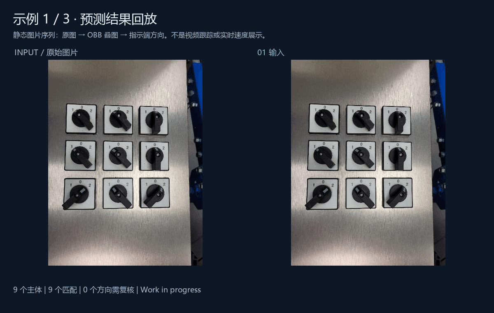
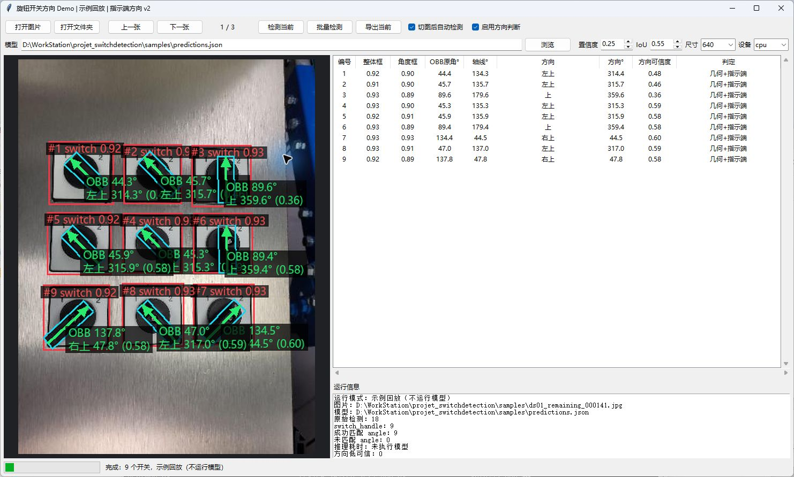
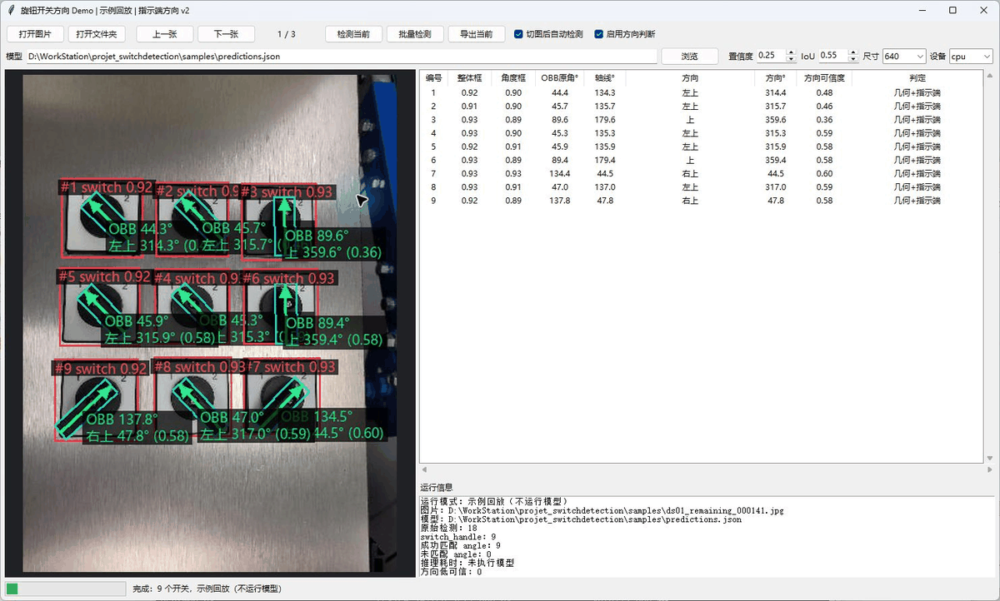
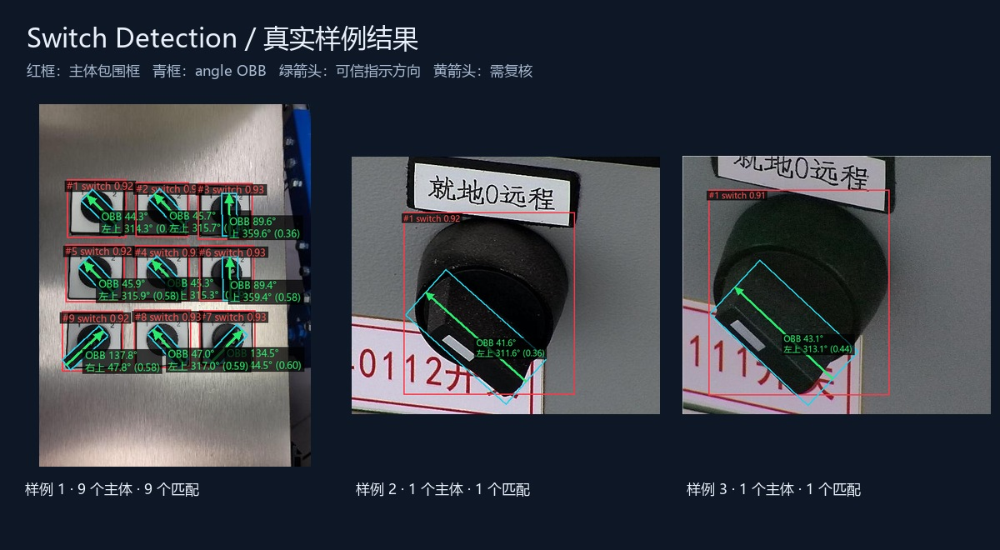
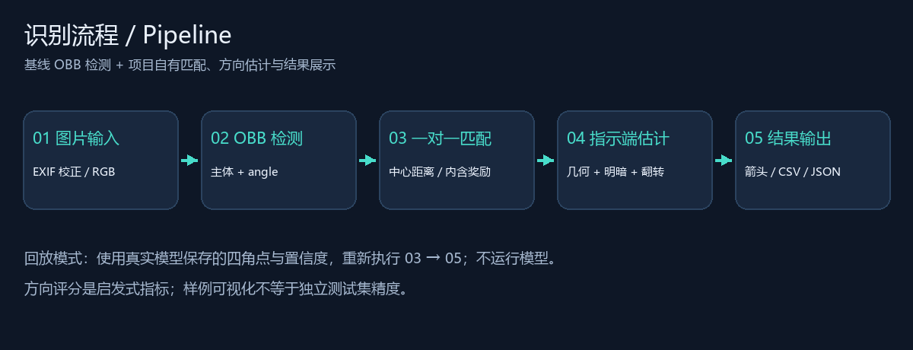
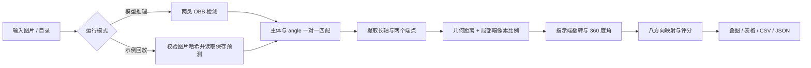
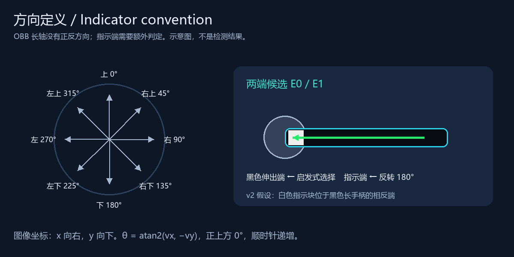

<div align="center">

# Switch Detection

### 旋钮开关检测与指示方向识别

**OBB 定位 · 几何匹配 · 指示端估计 · 桌面演示 · 数据治理**


[效果展示](#效果展示) · [快速开始](#快速开始) · [界面操作](#界面操作) · [算法解析](#算法解析) · [训练与验证](#训练与验证) · [开发进度](#开发进度)

</div>

本项目面向工业面板中的旋钮选择开关，完成“找到开关 → 匹配角度框 → 估计指示方向 → 可视化与结构化导出”的实验流程。项目提供图片/文件夹检测界面、无界面批量运行、数据审计与标注准备工具，并保留可复现的展示样例。

> **🚧 开发中 / Work in Progress**
> 当前为可运行的实验与演示项目。指示方向由检测框几何和局部图像外观共同推断，尚未完成独立方向真值评估；示例结果不能替代工业现场验收。

## 效果展示

### 动态流程预览



GIF 展示三张静态图片的“输入 → 模型 OBB 预测 → 指示方向”回放。四角点与检测置信度来自已有标准基线模型的真实推理，方向由项目算法重新计算。**这是图片序列展示，不是摄像头视频、目标跟踪或推理速度测试。**

### 运行中的桌面界面



实际程序截图：左侧显示叠加结果，右侧列出主体置信度、angle 置信度、OBB 原角、轴线角、指示方向、启发式方向评分和判定方法。截图运行于示例回放模式。

<details>
<summary>展开查看实际界面切图 GIF</summary>



来自实际运行窗口的三张截图循环，展示切图后的图像与表格更新；播放间隔不代表推理耗时。

</details>

### 样例结果



| 颜色 | 含义 |
| --- | --- |
| 红框 | 开关主体 OBB 的水平外接框，便于展示整体位置 |
| 青框 | `angle` 类旋转框，保留手柄长轴信息 |
| 绿箭头 | 指示端方向，启发式评分达到当前阈值 |
| 黄箭头与 `?` | 方向评分较低，需要人工复核 |
| 紫框 | 检测到 angle，但没有匹配到主体 |

| 展示图片 | 检测主体数 | 主体/angle 匹配数 |
| --- | ---: | ---: |
| 多开关面板 `000141` | 9 | 9 |
| 单开关近景 `000229` | 1 | 1 |
| 单开关另一视角 `000324` | 1 | 1 |

以上为运行结果计数，不是正确率。原始预测、图片/模型哈希与推理参数见 [samples/predictions.json](samples/predictions.json)，输出明细见 [展示结果 JSON](assets/showcase/results.json)。

## 项目能力

| 模块 | 已实现内容 |
| --- | --- |
| 桌面 Demo | 图片/目录加载、自动切图检测、模型选择、参数调整、结果表格、批量处理 |
| 无权重回放 | 使用三张示例的保存预测，重新执行匹配、方向估计、叠图和导出 |
| 模型推理 | 加载外部标准 OBB 权重，输出主体与 angle 检测 |
| 方向算法 | 长轴提取、主体/angle 一对一匹配、几何/明暗端点判定、八方向映射 |
| 结果导出 | 当前图片 JPEG/PNG + CSV/JSON，目录批处理保留相对路径 |
| 数据整理 | 图像哈希去重、跨来源重叠审计、标签规范化、分组拆分、CVAT 打包 |
| 基线工具 | 参数化的 OBB 训练、验证、普通推理入口和数据配置示例 |

项目自己的代码位于 `switch_orientation_demo/` 和数据工具脚本中。Ultralytics 作为外部模型推理依赖安装；此版本只发布应用代码与少量展示样例。

## 快速开始

### 1. 克隆与安装

建议使用 Python 3.10。基础回放环境不需要 PyTorch、CUDA 或模型权重。

```bash
git clone https://github.com/HermitKin/switch_detection.git
cd switch_detection
python -m venv .venv
```

Windows PowerShell：

```powershell
.\.venv\Scripts\python.exe -m pip install -r requirements.txt
.\.venv\Scripts\python.exe -m switch_orientation_demo --replay --show-direction
```

Linux / macOS：

```bash
.venv/bin/python -m pip install -r requirements.txt
.venv/bin/python -m switch_orientation_demo --replay --show-direction
```

Windows 安装完成后也可双击 `run_switch_orientation_demo.bat`。Linux 的桌面界面需要发行版提供 Tk；无界面模式不依赖 GUI。

### 2. 无界面回放与导出

```bash
python -m switch_orientation_demo --replay --no-gui --show-direction --output outputs/replay
```

上文 `python` 表示虚拟环境中的解释器。未激活环境时，替换为 `.venv\Scripts\python.exe` 或 `.venv/bin/python`。

回放默认载入 `samples/`，仅接受哈希一致的原始示例。它从保存的预测重新计算方向，不会对新图片运行模型。已保存预测采用 `conf=0.25`、`iou=0.55`、`imgsz=640`；回放允许提高置信度阈值，其他检测参数保持原值。

### 3. 对新图片运行模型

```bash
python -m pip install -r requirements-inference.txt
python -m switch_orientation_demo --model path/to/best.pt --input path/to/images --device cpu --show-direction
```

已有兼容 CUDA 的 PyTorch 环境时可使用 `--device 0`。不加 `--show-direction` 时，只查看模型 OBB 原角和检测结果。

业务权重需要单独准备，默认位置是 `models/switch_yolo11n_obb.pt`。也可通过 `--model` 指向 `best.pt`、含有 `best.pt` 的 weights 目录或训练结果目录。输入必须是 OBB 模型，类别约定为 `0: switch_handle`、`1: angle`；通用预训练 OBB 权重不能直接识别本项目类别。

### 4. 模型批量运行

```bash
python -m switch_orientation_demo --model path/to/best.pt --input path/to/images --no-gui --show-direction --output outputs/batch --device cpu
```

输入支持 JPG/JPEG、PNG、BMP、WebP、TIF/TIFF；文件夹递归检索图片。输出目录应置于输入目录之外，避免下次扫描混入结果图。子目录中的同名文件会分别保存。

## 界面操作

1. 在回放模式中浏览默认三张样例；模型模式中选择模型，并通过“打开图片”或“打开文件夹”载入内容。
2. 点击“检测当前”；开启“切图后自动检测”后，切换图片会自动更新结果。
3. 勾选“启用方向判断”，查看箭头、八方向名称和完整结果列。切换选项后需重新检测当前图片。
4. 用“导出当前”保存叠图及同名 CSV/JSON；用“批量检测”选择输出目录。

| 操作 | 快捷键 |
| --- | --- |
| 上一张 / 下一张 | `←` / `→` |
| 检测当前 | `Space` |
| 打开图片 | `Ctrl+O` |
| 导出当前 | `Ctrl+S` |

| 参数 | 默认值 | 影响 |
| --- | --- | --- |
| `--conf` | 0.25 | 模型检测候选置信度门限，非方向门限 |
| `--iou` | 0.55 | 模型 NMS 阈值 |
| `--imgsz` | 640 | 推理输入尺寸 |
| `--device` | cpu | 推理设备 |
| `--show-direction` | 关闭 | 启用指示端启发式估计 |
| `--replay` | 关闭 | 回放保存预测，省略模型推理 |

## 流程分析





桌面检测在工作线程中执行，结果通过事件队列回到 Tk 主线程更新，避免推理阻塞界面。模型对象在同一进程内缓存；更换权重路径时重新加载。

## 算法解析

实现位置：[algorithm.py](switch_orientation_demo/algorithm.py)。这里区分三种角度，避免把模型旋转框角度直接当作开关档位方向。

| 字段 | 定义 |
| --- | --- |
| `obb_angle_degrees` | 模型 `xywhr` 中原始弧度转成度，保留上游参数语义 |
| `axis_degrees` | 从四角点得到的无向长轴，上方为起点，取模 180° |
| `direction_degrees` | 经端点判断后的有向指示方向，上方 0°、顺时针、范围 [0°, 360°) |

### 1. 主体与 angle 匹配

主体中心为四角点均值，尺度为多边形面积平方根。对每个主体 `s` 与 angle `a` 计算：

$$
d(s,a)=\frac{\|c_s-c_a\|_2}{\max(\sqrt{A_s},1)},\qquad
cost(s,a)=d(s,a)-0.7\cdot\mathbf{1}[c_a\in s]
$$

angle 中心位于主体内部，或归一化距离不大于 `0.9` 时，形成候选配对。按 cost 升序贪心选择，主体和 angle 各最多使用一次。未匹配主体保留并标记“未检测到 angle”；未匹配 angle 以紫框显示。

此方法便于处理多个开关，但不是全局最优分配；拥挤或重叠场景中可能误配。候选计算复杂度为 `O(S×A)`，排序约为 `O(K log K)`。

### 2. 从四角点提取长轴

计算四条边的长度，选最长边单位向量 `u`。angle 框中心 `c`、长边长度 `L`、短边宽度 `W` 给出两个候选端点：

$$
E_0=c-\frac{L}{2}u,\qquad E_1=c+\frac{L}{2}u
$$

仅有矩形不能区分这两个端点的正反。相同 OBB 转动 180° 后仍表示同一个区域，因此额外使用几何和局部外观信号。

### 3. 端点判定：几何与明暗

**几何信号：** 距开关整体中心更远的一端，作为黑色长手柄伸出端候选。几何评分为：

$$
g=\min\left(1,\frac{|\|E_0-c_s\|-\|E_1-c_s\||}{\max(0.25L,1)}\right)
$$

**外观信号：** 沿长轴在两侧各采样一个 `28×20` 网格：长轴覆盖 `[-0.40L,-0.10L]` 和 `[0.10L,0.40L]`，横轴覆盖 `[-0.40W,0.40W]`。双线性采样后，对合并像素使用 Otsu 阈值，计算两端暗像素比例 `D0`、`D1`。暗像素比例较小的一端作为伸出端候选：

$$
a=\min(1,|D_0-D_1|/0.30)
$$

**融合规则：** 两种信号同意时 `h = 0.55g + 0.45a`；冲突时采用评分较大的信号，`h = 0.65 max(g,a)`，降低冲突情况下的评分。

### 4. 指示端约定与八方向



当前 v2 实现针对演示中的选择开关：**白色指示块位于黑色长手柄伸出端的相反侧。** 因此在选出黑色伸出端后，把箭头翻转 180°，指向指示端。该约定来自当前开关结构，换型时必须复核，不适用于所有旋钮。

图像坐标 `x` 向右、`y` 向下。设最终指示向量为 `v = tip - base`：

$$
\theta=\left(\operatorname{atan2}(v_x,-v_y)\cdot\frac{180}{\pi}+360\right)\bmod360
$$

八方向索引为 `floor((θ + 22.5) / 45) mod 8`。

| 上 | 右上 | 右 | 右下 | 下 | 左下 | 左 | 左上 |
| --- | --- | --- | --- | --- | --- | --- | --- |
| 0° | 45° | 90° | 135° | 180° | 225° | 270° | 315° |

### 5. 评分与不确定性

最终方向分数为 `q = clip(h × angle_detection_confidence, 0, 1)`。当前门限为 `0.35`：达到门限显示绿色，否则黄色并标记 `?`。这不是经过校准的方向正确概率；绿色只表示算法内部评分达标。

反光、阴影、近正方形 angle 框、遮挡、主体中心偏移或白色指示块不可见，都可能影响正反判定。未启用方向判断时，方向字段留空，只展示模型原角。开关的“开/关、就地/远程”等语义档位还需要结合面板布局、档位文字或设备规则映射，本版本输出的是几何指示方向。

## 数据格式与数据治理

OBB 标签每行使用类别和四个归一化角点：

```text
class_id x1 y1 x2 y2 x3 y3 x4 y4
```

类别约定：`0: switch_handle` 为整体开关，`1: angle` 为细长角度区域。角点顺序需沿矩形周边连续排列。标签与图像同名，坐标范围 `[0,1]`。

```text
datasets/switch/
├─ train/images/   ├─ train/labels/
├─ val/images/     ├─ val/labels/
└─ test/images/    └─ test/labels/
```

| 环节 | 主要脚本 |
| --- | --- |
| 图像/标签审计 | `dataset_audit.py`、`audit_switch_obb.py` |
| 去重与来源检查 | `audit_duplicate_images.py`、`compare_ds01_ds04_overlap.py` |
| 规范类别/文件名 | `normalize_switch_handle_labels.py`、`rename_switch_dataset_files.py` |
| OBB 标注池准备 | `prepare_obb_dataset.py` |
| 分组拆分与标注批次 | `prepare_grouped_split_and_pose_test.py`、`select_pose_annotation_batch.py` |
| 小验证集与 CVAT 打包 | `build_small_validation_dataset.py`、`package_ds06_for_cvat.py`、`package_ds06_cvat_by_split.py` |
| GT 复核 | `visualize_gt.py`、`visualize_ultralytics_obb_gt.py` |

整理顺序建议为审计 → 来源分组/去重 → 标签规范化 → 人工 OBB 标注与可视化复核 → 按来源拆分 → 训练/验证。部分历史脚本绑定一次性数据集名称与本地路径；执行前需阅读文件顶部常量和 `--help`。带删除语义的历史脚本不是快速开始步骤。

## 训练与验证

安装推理依赖，复制 [数据配置示例](configs/switch_obb.example.yaml)，修改 `path` 为实际数据集目录。下面的初始权重为标准 OBB 预训练权重，训练后才产生本项目两类检测能力。

```bash
python -m tools.obb_baseline train --data configs/switch_obb.example.yaml --model yolo11n-obb.pt --epochs 100 --batch 16 --device 0
python -m tools.obb_baseline val --data configs/switch_obb.example.yaml --model outputs/baseline/switch_obb/weights/best.pt --split test --device 0
python -m tools.obb_baseline predict --model path/to/best.pt --source path/to/images --device cpu
```

训练默认 `seed=42`，输出放在 `outputs/baseline/`，支持指定设备、尺寸、批大小与 worker 数。权重、完整数据、训练日志和研发实验源码保持在本地。

基线验证主要衡量 OBB 检测质量，不会自动得到方向正确率。方向评估还需要独立的指示端真值，建议分别报告匹配率、180° 翻转错误率、方向角误差、八方向分类准确率和不确定样本比例。当前不公布缺少独立标注支持的精度结论。

## 输出与复现

批量输出包含逐图叠加 JPEG、`orientation_results.csv` 和 `summary.json`。JSON 标记 `mode: inference` 或 `mode: replay`；回放不执行模型，因此 `inference_ms` 为 `null`。

| CSV 字段 | 内容 |
| --- | --- |
| `image` / `object_index` | 图片名 / 当前图片目标编号 |
| `switch_confidence` / `angle_confidence` | 模型两类检测分数 |
| `obb_angle_radians` / `obb_angle_degrees` | 模型原始角度 |
| `axis_degrees` | 无向长轴角度 |
| `direction` / `direction_degrees` | 八方向名称 / 有向角度 |
| `direction_confidence` / `direction_reliable` | 启发式评分 / 是否达门限 |
| `decision_method` | 几何、外观或二者融合，加指示端约定 |

重新生成 README 展示素材：

```bash
python -m tools.make_showcase
```

重新保存模型预测并制作素材（需准备同类别标准权重）：

```bash
python -m tools.make_showcase --capture --model path/to/best.pt
```

模型预测 JSON 保留 SHA-256、采集时间、框架版本和检测参数；普通图与 GIF 从相同记录生成。GUI 截图来自实机操作，更新界面后应重新截取。

## 目录结构

```text
switch_detection/
├─ switch_orientation_demo/       # 算法、GUI、CLI
├─ demo_switch_orientation.py     # 兼容入口
├─ run_switch_orientation_demo.bat
├─ samples/                      # 3张原图与真实预测回放记录
├─ assets/showcase/               # GUI截图、叠图、GIF、算法图解
├─ configs/                      # 可修改的数据配置示例
├─ tools/                        # 展示素材生成、标准OBB基线入口
├─ verification/                 # 算法与回放回归测试
├─ requirements.txt              # 轻量回放依赖
├─ requirements-inference.txt    # 可选模型推理依赖
└─ *.py                          # 历史数据审计/标注准备工具
```

## 验证与常见问题

```bash
python -m unittest discover -s verification -v
python -m switch_orientation_demo --replay --no-gui --show-direction --output outputs/smoke
```

测试覆盖四个主方向、八方向边界、角点顺序、一对一匹配、孤立 angle、空检测、指示端翻转、回放图片校验、参数一致性、空目录与同名文件导出。仓库 CI 执行轻量回放与回归测试；不下载业务模型。

| 问题 | 处理 |
| --- | --- |
| 找不到模型 | 先使用 `--replay` 查看示例；新图推理用 `--model` 提供业务权重 |
| 新图片不能回放 | 回放只支持哈希一致的三张原图；任意图片需运行模型 |
| 找不到 Tk / 无图形桌面 | 使用 `--no-gui`；Linux GUI 另外安装 Tk 和图形环境 |
| GPU 不可用 | 用 `--device cpu`；GPU需匹配的驱动与PyTorch环境 |
| 出现研发模块导入错误 | 从干净克隆和虚拟环境运行，检查 `ultralytics.__file__` 的来源 |
| OBB角与方向角不同 | 两者坐标含义不同，见角度字段表和指示端约定 |
| 导出列为空或带问号 | 未启用方向、未匹配 angle 或方向分数未达门限，按判定方法复核 |

## 开发进度

- [x] 图片与目录 GUI / CLI 演示
- [x] 标准 OBB 模型加载、主体/angle 匹配与方向可视化
- [x] CSV / JSON / 结果图导出
- [x] 无权重样例回放、真实预测记录、截图与 GIF
- [x] 数据整理工具、可移植基线命令、算法回归测试
- [ ] 独立方向标注、完整指标评估与阈值校准
- [ ] 更复杂遮挡场景匹配和不同开关的指示端适配
- [ ] 结合面板语义的档位状态识别
- [ ] 实时视频、跟踪与现场部署评估

## 依赖与素材说明

外部 OBB 格式/API 参考 [Ultralytics OBB 文档](https://docs.ultralytics.com/tasks/obb/)，模型推理环境固定使用 [Ultralytics v8.3.9](https://github.com/ultralytics/ultralytics/tree/v8.3.9)。上游在线文档会随版本更新，本文算法参数以仓库代码为准。

第三方依赖、项目代码许可现状与展示图片来源说明见 [THIRD_PARTY_NOTICE.md](THIRD_PARTY_NOTICE.md)。展示样例用于说明功能，原始数据许可待补充。
